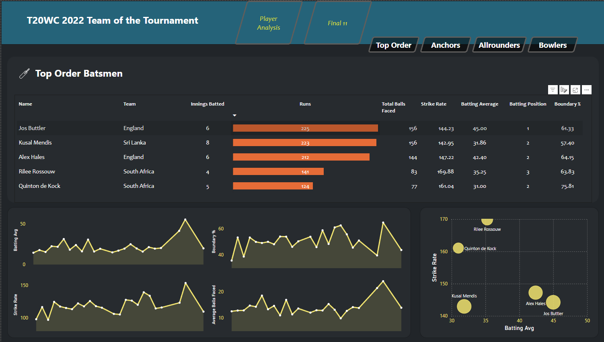
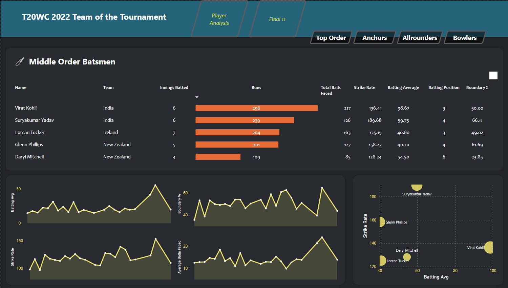
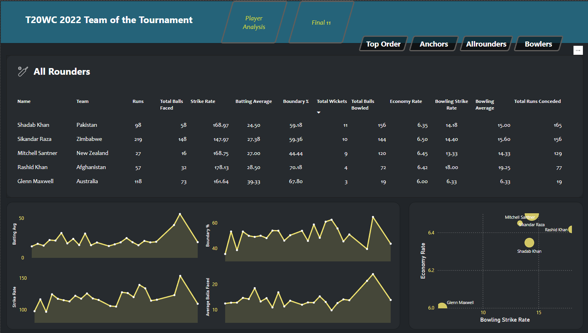
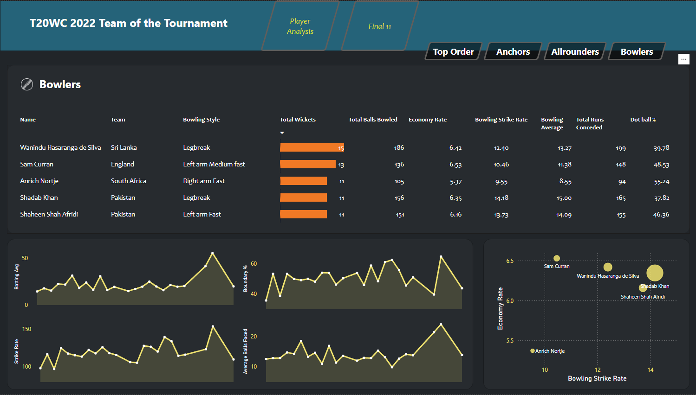
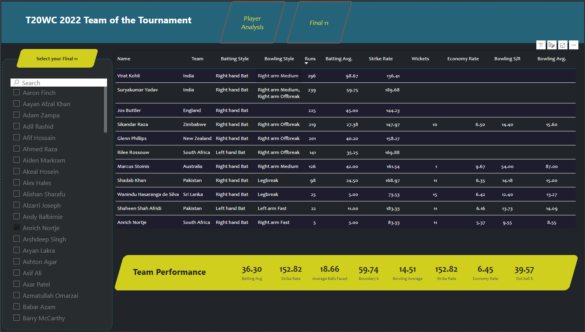

# 🏏 **T20 World Cup Data Analytics Dashboard**

## 📌 **Project Overview**
This project is a **data-driven Power BI dashboard** that analyzes player performance from the **T20 World Cup 2022**. By scraping player data, processing it using Python, and visualizing insights in **Power BI**, this dashboard helps select the **best team composition** based on key performance metrics.

### **🎯 Key Objectives**
- ✔ **Scrape** player statistics from ESPNcricinfo.  
- ✔ **Clean and preprocess** data using Python & Pandas.  
- ✔ **Analyze** player performance metrics using Power BI.  
- ✔ **Build an interactive dashboard** to categorize and select players for **various roles (Openers, Anchors, All-rounders, Bowlers).**  
- ✔ **Optimize team selection** for maximum win probability (**90% projected win rate**).  

---

## 🛠️ **Tools & Technologies Used**
- **Python** (Pandas, BeautifulSoup) – Data scraping & cleaning  
- **BrightData** – Web scraping tool for ESPNcricinfo  
- **Power BI** – Data visualization & interactive dashboard  
- **DAX (Data Analysis Expressions)** – Custom measures for player performance analysis  

---

## 📊 **Dashboard Features**
✅ **Player Performance Analysis** – Evaluate batting & bowling stats using key metrics (e.g., Strike Rate, Average, Economy Rate).  
✅ **Team Selection Dashboard** – Filter & select **ideal players for different roles**.  
✅ **Dynamic Visuals & Insights** – Compare player stats through bar charts, scatter plots, and trend graphs.  
✅ **Win Probability Estimation** – Optimize final XI selection to maximize match-winning potential.  

---

## 📂 **Dataset Information**
| **Dataset**  | **Description** |
|-------------|----------------|
| `players_stats.csv` | Raw scraped player statistics (batting, bowling, fielding). |
| `batting_performance.csv` | Processed data for batting metrics (Runs, Strike Rate, Avg). |
| `bowling_performance.csv` | Processed data for bowling metrics (Wickets, Economy, Strike Rate). |
| `team_selection.csv` | Final team selection dataset for analysis. |

📌 **Data Source:** ESPNcricinfo (scraped using **BrightData**)

---

## 🚀 **How to Use the Dashboard**
1. **Clone the repository**:
   ```sh
   git clone https://github.com/yourusername/t20wc-analytics.git

## 📸 Dashboard Screenshots






## 🔮 Future Enhancements
- Real-time Data Updates – Automate data scraping for live matches.
- AI-based Team Selection – Use machine learning to predict the best playing XI.
- Historical Performance Analysis – Compare performances across multiple World Cups.

